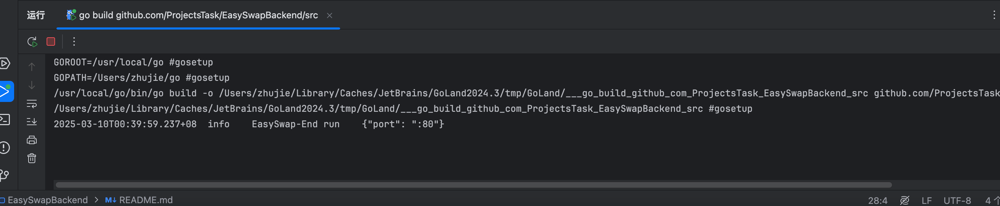

### EasySwapBackend

一个支持多链的 NFT 交易平台的后端服务，主要负责处理用户请求、管理订单信息、查询用户资产和集合信息等。它通过与数据库交互，提供了丰富的 API 接口，支持用户进行 NFT 的查询和管理操作。

#### 核心功能

1. **用户资产管理**
   - 查询用户在不同区块链上的 NFT 资产。
   - 提供用户的资产组合信息。

2. **订单信息管理**
   - 获取指定 NFT 的出价信息，包括单个 NFT 的最高出价和整个 Collection 的最高出价。
   
3. **集合和项目管理**
   - 查询和管理 NFT 集合的信息。
   - 提供集合的排名和统计数据。

4. **活动和交易记录**
   - 记录用户的交易活动。
   - 提供交易历史查询。

#### 核心类

1. **Service 层**
   - `portfolio.go`: 处理用户资产组合的查询。
   - `order.go`: 获取订单信息，处理出价信息。
   - `collection.go`: 管理 NFT 集合的信息和排名。
   - `activity.go`: 记录和查询用户的交易活动。

2. **DAO 层**
   - 负责与数据库的交互，执行数据的增删改查操作。

3. **API 层**
   - 提供 RESTful API 接口，供前端和其他服务调用。

#### 调用执行流程

1. **用户请求**
   - 用户通过前端发送请求到后端 API 接口。

2. **服务处理**
   - API 接口接收请求后，调用相应的服务层方法进行处理。
   - 服务层与 DAO 层交互，获取或更新数据库中的数据。

4. **响应返回**
   - 服务层处理完成后，将结果返回给 API 接口。
   - API 接口将结果以 JSON 格式返回给前端。

#### 用户操作使用

- **查询用户资产**
  - 用户可以查询自己在不同区块链上的 NFT 资产和组合信息。

- **获取订单信息**
  - 用户可以查看 NFT 的出价信息，包括最高出价。

- **查看集合信息**
  - 用户可以查看 NFT 集合的详细信息和排名。

- **查看交易记录**
  - 用户可以查询自己的交易历史和活动记录。

EasySwapBackend 项目通过提供丰富的 API 接口和高效的服务处理，支持用户在多链环境下进行 NFT 的交易和管理，提升了用户的使用体验和平台的可扩展性。

#### 如何运行项目

准备条件

1. 确保将下面三个 repo 都pull同一个本地目录
   - EasySwapBackend
   - EasySwapBase
   - EasySwapSync
     -- EasySwapBackend
     -- EasySwapBase
     -- EasySwapSync

2. 复制下配置文件 `cp config/config.toml.example  config/config.toml`

3. 打开 go.mod 这一行的注释，然后 终端执行 `go mod tidy`

```shell
replace github.com/ProjectsTask/EasySwapBase => ../EasySwapBase
```

3. infura 上面注册一个账号，给 `chain_supported.endpoint` 替换掉

4. 通过部署 EasySwapContract（看里面的README.md）得到订单簿合约的地址 替换掉 config/config.toml 中的 easyswap_market.contract 

5. docker 上面 运行一下 `EasySwapSync/docker-compose.yml` 给 redis 和 mysql 环境整好

6. 运行以下指令，如果你是 goland ide 你可以直接到 src/main.go 上面点击启动

```shell
cd src
go run main.go
```

如图：恭喜你后端 的api 服务运行成功了！

