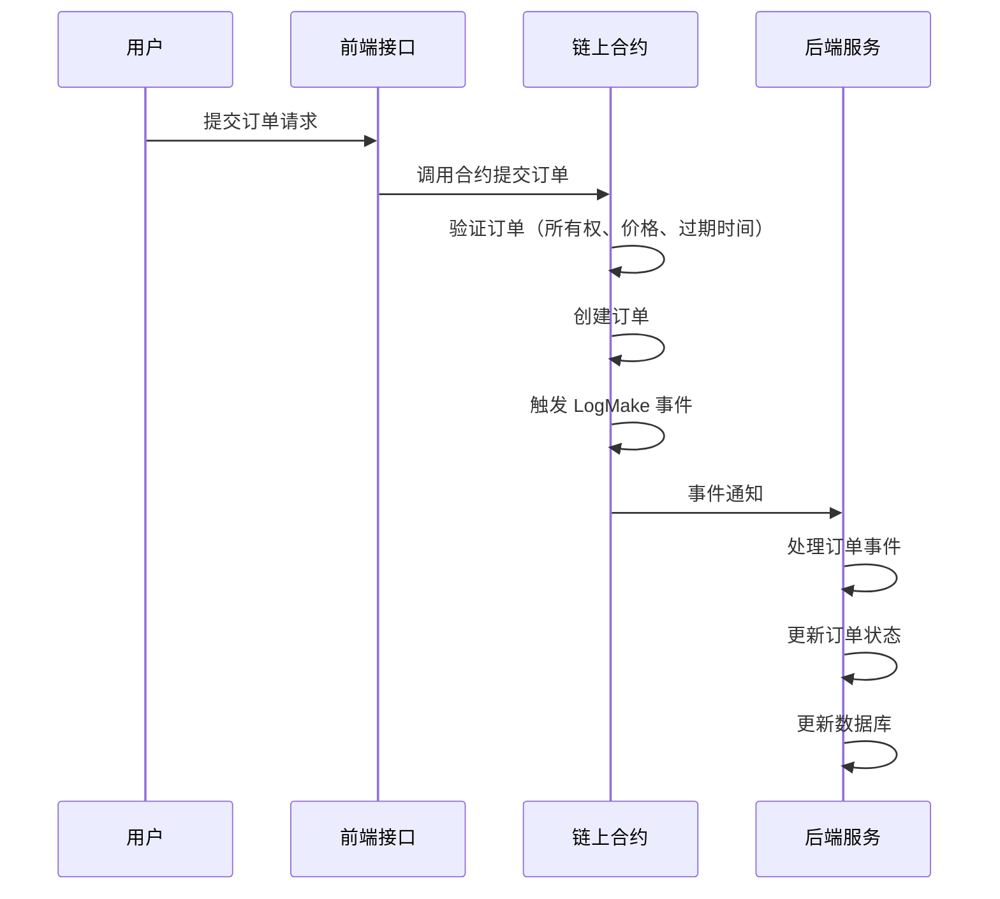
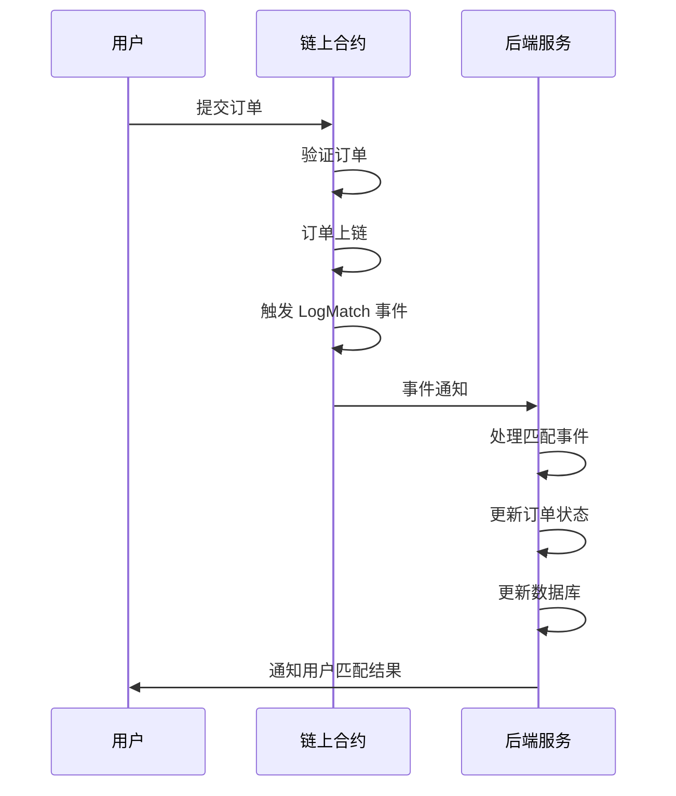

## EasySwapBase

一个基于 Go 语言开发的 NFT 交易平台基础框架，主要用于处理 NFT 交易、订单管理和价格计算等核心功能。项目采用链上合约+后端服务的架构，确保交易的安全性和可靠性。

### 1. 核心功能

1. **订单管理（OrderManager）**
   - 订单队列管理
   - 过期订单处理
   - 订单列表统计
   - 地板价计算

2. **区块链交互（EVM）**
   - 智能合约交互
   - 交易处理
   - 事件监听

3. **数据存储（Stores）**
   - 数据库操作
   - 缓存管理

4. **HTTP 服务（XHTTP）**
   - API 接口
   - 请求处理
   - 响应格式化

### 2. 项目流程

#### 2.1 调用执行流程

1. 用户提交订单

   - 用户通过前端接口提交订单请求。

   - 前端接口将请求转发给链上智能合约。

2. 链上合约处理

   - 智能合约验证订单的合法性。

   - 验证通过后，订单被记录在区块链上。

   - 触发订单创建或匹配事件。

3. 后端服务处理

   - 后端服务监听链上事件。

   - 处理订单创建或匹配结果。

   - 更新订单状态和数据库。

#### 2.2 订单创建流程


* 说明

1. 用户提交订单
   - 用户通过前端接口提交订单请求，包含订单的详细信息（如 NFT 地址、价格、过期时间等）。

2. 前端接口处理
   - 前端接口将用户的订单请求转发给链上智能合约进行处理。

3. 链上合约验证

   - 智能合约在链上进行订单验证，包括：

   * 验证 NFT 所有权：确保提交订单的用户是 NFT 的合法拥有者。

   - 验证价格有效性：确保订单价格大于零。

   - 验证过期时间：确保订单的过期时间在当前时间之后。

4. 订单创建
   - 验证通过后，智能合约在链上创建订单，并生成唯一的订单 ID。

5. 事件触发
   - 智能合约触发 LogMake 事件，通知后端服务有新的订单创建。

6. 后端服务监听
   - 后端服务监听链上事件，接收到 LogMake 事件后，解析事件数据。

7. 订单处理
   - 后端服务根据事件数据更新订单状态，并将订单信息存储到数据库中。

8. 状态更新
   - 后端服务更新订单的状态信息，如订单是否已完成、是否已过期等。

* 主要特点

  - 链上验证：所有关键的订单验证逻辑都在链上合约中完成，确保交易的安全性和不可篡改性。

  - 事件驱动：后端服务通过监听链上事件来处理订单，确保系统的实时性和响应速度。

  - 数据持久化：后端服务负责将订单信息持久化到数据库中，便于后续查询和统计分析。

  - 安全性：通过链上合约的验证机制，确保只有合法的订单才能被创建和处理。

#### 2.3 订单匹配流程



* 说明

1. 用户提交订单
   - 用户通过前端接口提交订单请求，订单信息被发送到链上智能合约。

2. 链上合约验证
   - 智能合约在链上进行订单验证，确保订单的合法性和有效性。

3. 订单上链
   - 验证通过后，订单被记录在区块链上，确保其不可篡改。

4. 事件触发
   - 智能合约在订单匹配成功时触发 LogMatch 事件，通知后端服务有订单匹配成功。

5. 后端服务监听
   - 后端服务监听链上事件，接收到 LogMatch 事件后，解析事件数据。

6. 订单处理
   - 后端服务根据事件数据更新订单状态，并将匹配结果存储到数据库中。

7. 状态更新
   - 后端服务更新订单的状态信息，如订单是否已完成、NFT 所有权转移等。

8. 用户通知
   - 后端服务将订单匹配结果通知给用户，用户可以查看订单的最新状态。

### 3. 核心类说明

1. **OrderManager**
   - `service.go`: 订单服务主逻辑
   - `queue.go`: 订单队列管理
   - `expiredorder.go`: 过期订单处理
   - `floorprice.go`: NFT 地板价计算

2. **EVM 模块**
   - 处理与以太坊网络的交互
   - 智能合约调用
   - 交易签名和发送

3. **Stores 模块**
   - 数据库操作封装
   - 缓存管理，使用 go-zero 的 Redis 存储模块来管理缓存和数据存储，提供高效的读写操作
   - 数据持久化

### 4. 订单匹配实现

1. **链上匹配**
```go
// handleMatchEvent 处理链上匹配事件
func (s *Service) handleMatchEvent(log ethereumTypes.Log) {
    var event struct {
        MakeOrder Order
        TakeOrder Order
        FillPrice *big.Int
    }
    // 解析链上匹配事件
    err := s.parsedAbi.UnpackIntoInterface(&event, "LogMatch", log.Data)
    // ...
}
```

2. **订单队列管理**
```go
type PriorityQueueMap struct {
    pq     PriorityQueue
    orders map[string]*Entry
    maxLen int
}

// 添加订单到优先级队列
func (pqm *PriorityQueueMap) Add(orderID string, price decimal.Decimal, maker, tokenID string) {
    // 根据价格排序的订单队列
    // ...
}
```

3. **价格匹配规则**
```go
case Listing: // 上架事件
    // 只有当价格低于队列最高价或队列为空时才添加订单
    _, price := tradeInfo.orders.GetMax()
    if price.GreaterThan(event.Price) || tradeInfo.orders.Len() == 0 {
        tradeInfo.orders.Add(event.OrderId, event.Price, event.From, event.TokenID)
    }
```

4. **错误处理机制**

```go
// 错误处理示例
if err != nil {
    xzap.WithContext(s.ctx).Error("Error unpacking LogMatch event:", zap.Error(err))
    return
}
```

5. **状态更新机制**

```go
// 更新订单状态
if err := s.db.WithContext(s.ctx).Table(multi.OrderTableName(s.chain)).
    Where("order_id = ?", takeOrderId).
    Updates(map[string]interface{}{
        "order_status":       multi.OrderStatusFilled,
        "quantity_remaining": 0,
        "taker":              to,
    }).Error; err != nil {
    // 错误处理
}
```

### 5. 技术特点

1. 使用 Go 语言开发，性能高效
2. 采用微服务架构
3. 支持多链交互
4. 链上完成订单匹配，保证交易安全
5. 后端系统负责状态管理和价格计算
6. 通过事件驱动的方式处理匹配结果
7. 完整的错误处理和状态更新机制
8. 支持实时价格更新和订单管理

### 总结

这个项目为 NFT 交易平台提供了完整的基础设施，可以快速构建一个功能完善的 NFT 交易系统。通过链上合约和后端服务的结合，既保证了交易的安全性，又提供了良好的用户体验。