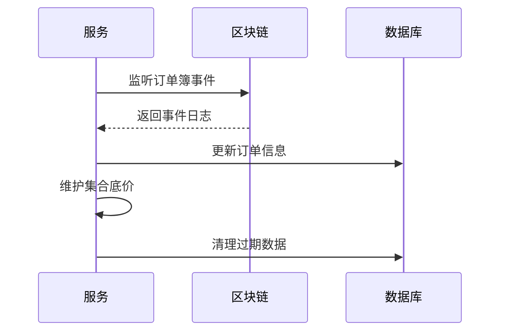

## EasySwapSync交易同步服务

一个用于同步和管理区块链上订单簿事件的服务。它通过监听区块链上的事件日志，更新数据库中的订单信息，并维护集合的底价变化。该项目的主要目标是确保订单簿数据的实时性和准确性。

### 核心功能

1. **订单簿事件同步**
   - 监听区块链上的订单创建、取消和匹配事件。
   - 根据事件类型更新数据库和订单管理队列。

2. **集合底价维护**
   - 定期清理过期的集合底价变化数据。
   - 更新集合的底价信息，确保价格信息的准确性。

3. **多链支持**
   - 支持多条区块链的同步操作，确保跨链数据的一致性。

### 核心类

- **Service 类**
  - 负责管理服务的主要功能，包括订单簿事件同步和集合底价维护。
  - 包含多个关键组件，如数据库连接、链客户端、订单管理器等。

- **Order 类**
  - 表示区块链上的订单信息，包括订单的买卖方、价格、过期时间等。

### 执行流程

1. **服务启动**

   `Service` 类的 `Start` 方法启动两个关键的循环任务：订单簿事件同步循环和集合底价变化的维护循环。

   - 代码位置: EasySwapSync/service/orderbookindexer/service.go 中的 Start 方法。

   - 功能: 启动服务的主要功能，包括订单簿事件同步和集合底价维护。

   - 执行逻辑:

   - 启动两个 goroutine，分别执行 SyncOrderBookEventLoop 和 UpKeepingCollectionFloorChangeLoop 方法。

2. **订单簿事件同步**

   `SyncOrderBookEventLoop` 方法持续监听区块链上的订单簿事件。

   - 代码位置: EasySwapSync/service/orderbookindexer/service.go 中的 SyncOrderBookEventLoop 方法。

   - 功能: 进入无限for循环持续监听区块链上的订单簿事件。

   - 执行逻辑:

     1. 从数据库中查询最后同步的区块高度。

     2. 获取当前区块链的最新区块高度。

     3. 比较最后同步的区块高度与当前区块高度。

     4. 如果需要同步，构建日志过滤查询条件。

     5. 获取区块内的所有日志。

     6. 根据日志的主题调用相应的事件处理函数，如 handleMakeEvent、handleMatchEvent、handleCancelEvent。

3. **事件处理**

   处理订单创建、取消和匹配事件，更新数据库和订单管理队列。

   - 代码位置:

     - handleMakeEvent: EasySwapSync/service/orderbookindexer/service.go 中的 handleMakeEvent 方法。

     - handleMatchEvent: EasySwapSync/service/orderbookindexer/service.go 中的 handleMatchEvent 方法。

     - handleCancelEvent: EasySwapSync/service/orderbookindexer/service.go 中的 handleCancelEvent 方法。

   - 功能: 处理不同类型的订单事件。

   - 执行逻辑:

     - 根据事件类型，更新数据库中的订单信息。

     - 更新订单管理队列。

4. **集合底价维护**

   `UpKeepingCollectionFloorChangeLoop` 方法定期清理过期的集合底价变化数据。

   - 代码位置: EasySwapSync/service/orderbookindexer/service.go 中的 UpKeepingCollectionFloorChangeLoop 方法。

   - 功能: 定期每天清理过期的集合底价变化数据，并更新集合的底价信息。

   - 执行逻辑:

     1. 定期调用 deleteExpireCollectionFloorChangeFromDatabase 方法清理过期数据。

     2. 每10秒调用 QueryCollectionsFloorPrice 方法查询当前集合的底价。

     3. 调用 persistCollectionsFloorChange 方法更新集合的底价信息。

### 流程图



EasySwapSync 项目通过高效的事件监听和数据维护，确保了订单簿数据的实时性和准确性，为多链环境下的 NFT 交易提供了可靠的支持。


### 运行
##### Mysql & Redis
You should get your MYSQL & Redis running and create a database inside. MYSQL & Redis inside docker is recommended for local testing.
For example, if the machine is arm64 architecture, you can use the following docker-compose file to start mysql and redis.
```shell
docker-compose -f docker-compose-arm64.yml up -d
```

For more information about the table creation statement, see the SQL file in the db/migrations directory.

##### Set Config file
Copy config/config.toml.example to config/config.toml. 
And modify the config file according to your environment, especially the mysql and redis connection information.
And set contract address in config file.

##### Run
Run command below
```shell
go run main.go daemon