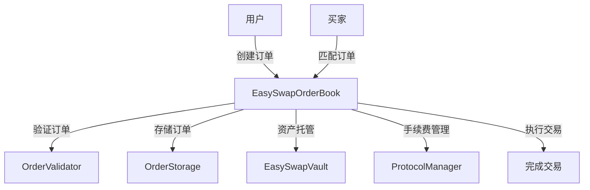
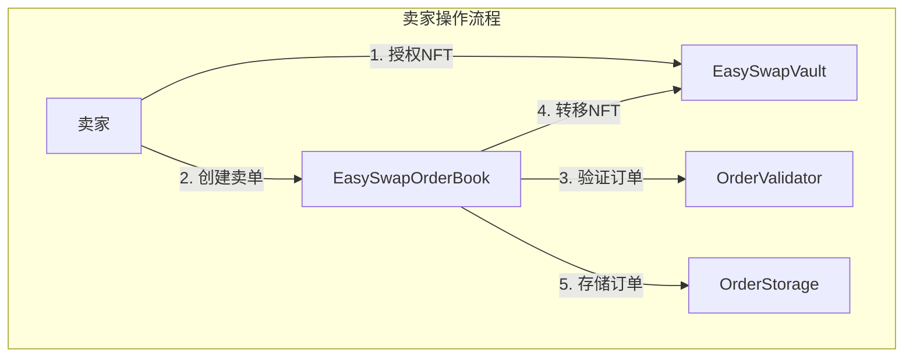
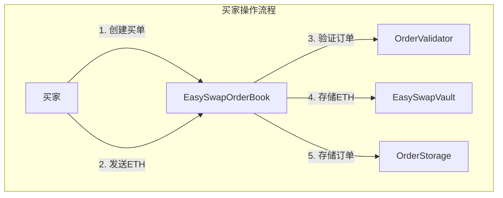
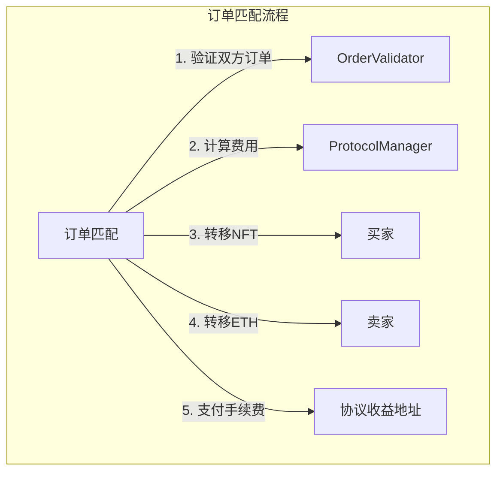
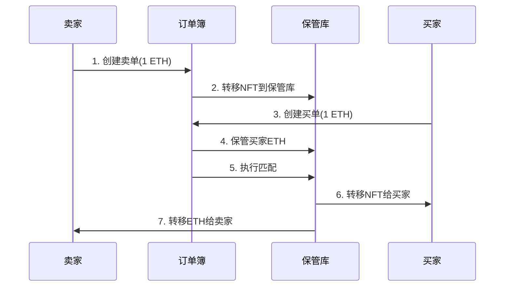
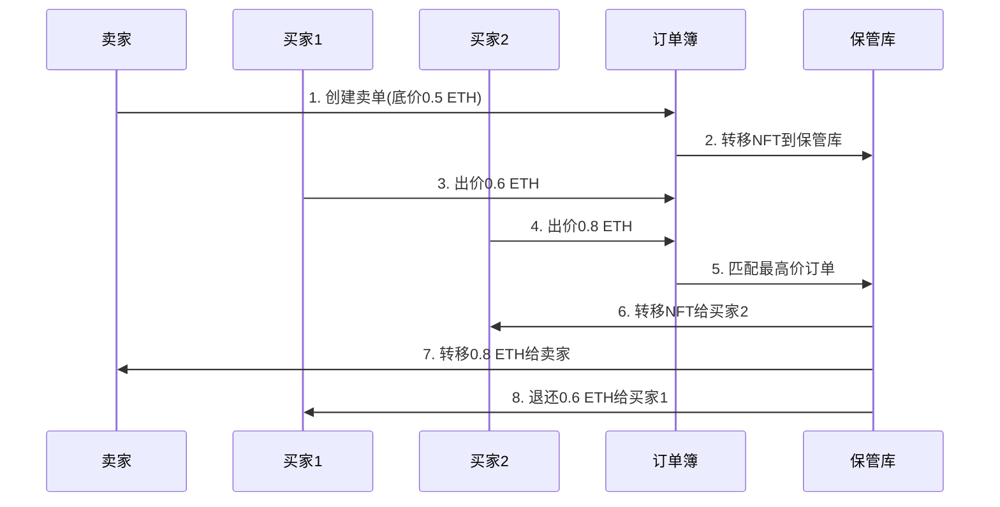
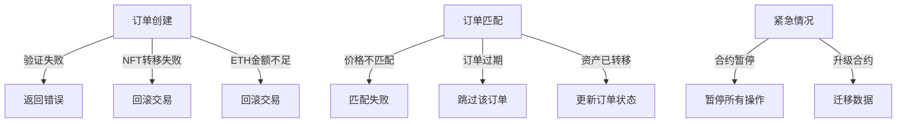
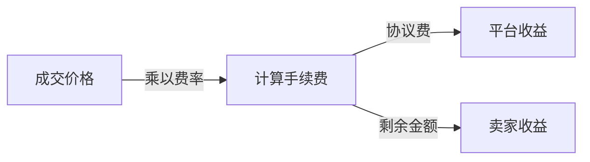
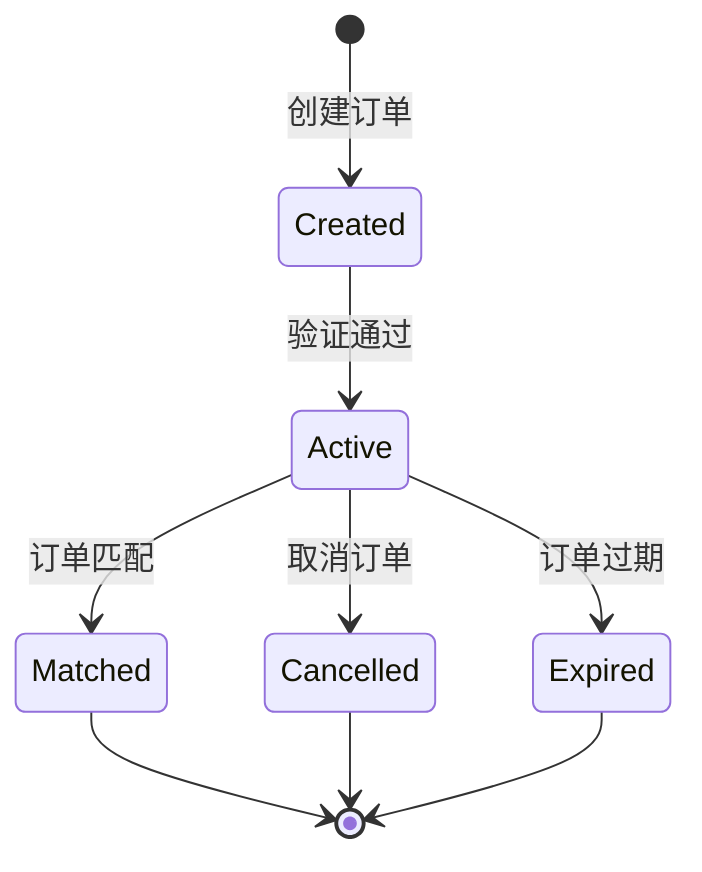
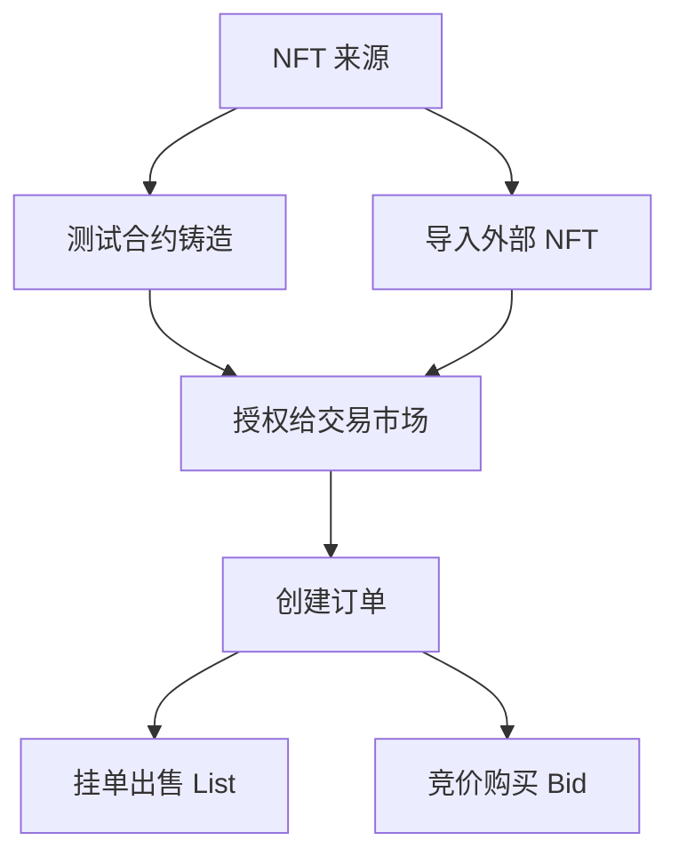

## 项目架构

这是一个`基于智能合约的 NFT 交易市场项目`，主要包含以下核心组件：

1. **主要合约**：
   - `EasySwapOrderBook.sol`：订单簿主合约
   - `ProtocolManager.sol`：协议管理合约
   - `OrderStorage.sol`：订单存储合约
   - `OrderValidator.sol`：订单验证合约
   - `EasySwapVault.sol`：资产保管库合约

2. **辅助库**：
   - `LibOrder`：订单相关的数据结构和函数
   - `LibPayInfo`：支付相关的工具函数
   - `LibTransferSafe`：安全转账相关的函数
   - `RedBlackTreeLibrary`：价格排序的红黑树实现

### 功能说明

1. **订单簿系统**
   - 支持挂单（List）和竞价（Bid）两种订单类型
   - 订单管理：创建、取消、匹配
   - 价格排序和订单匹配机制

2. **资产管理**
   - NFT 托管：将用户的 NFT 安全存储在保管库中
   - ETH 管理：处理买家支付的 ETH
   - 安全转账机制

3. **协议管理**
   - 费用设置：可配置协议费率
   - 权限控制：管理员可以更新协议参数
   - 可升级性：支持合约升级

### 执行流程



### 示例流程

1. **挂单出售 NFT**：
```solidity
// 1. 用户授权 NFT 给保管库
IERC721(nftAddress).approve(vaultAddress, tokenId);

// 2. 创建卖单
LibOrder.Order memory order = LibOrder.Order({
    side: LibOrder.Side.List,
    saleKind: LibOrder.SaleKind.FixedPrice,
    maker: msg.sender,
    nft: LibOrder.Asset(nftAddress, tokenId, 1),
    price: Price.wrap(1 ether),
    expiry: uint64(block.timestamp + 1 days),
    salt: uint64(block.timestamp)
});

// 3. 提交订单
orderBook.makeOrders([order]);
```

2. **购买 NFT**：
```solidity
// 1. 创建购买订单
LibOrder.Order memory order = LibOrder.Order({
    side: LibOrder.Side.Bid,
    saleKind: LibOrder.SaleKind.FixedPrice,
    maker: msg.sender,
    nft: LibOrder.Asset(nftAddress, tokenId, 1),
    price: Price.wrap(1 ether),
    expiry: uint64(block.timestamp + 1 days),
    salt: uint64(block.timestamp)
});

// 2. 提交订单并支付 ETH
orderBook.makeOrders{value: 1 ether}([order]);
```

### 完整操作流程图







### 详细操作流程示例

#### 1. 卖家挂单流程

```solidity
// 示例：卖家想要以 1 ETH 的价格出售 CryptoPunk #1234

// 步骤1：授权 NFT 给保管库
IERC721 cryptoPunks = IERC721(0x123...); // CryptoPunks 合约地址
cryptoPunks.approve(vaultAddress, 1234);

// 步骤2：创建卖单
LibOrder.Order memory sellOrder = LibOrder.Order({
    side: LibOrder.Side.List,
    saleKind: LibOrder.SaleKind.FixedPrice,
    maker: msg.sender,
    nft: LibOrder.Asset(
        0x123..., // CryptoPunks 地址
        1234,     // tokenId
        1         // 数量
    ),
    price: Price.wrap(1 ether),
    expiry: uint64(block.timestamp + 7 days), // 7天有效期
    salt: uint64(block.timestamp)
});

// 步骤3：提交卖单
orderBook.makeOrders([sellOrder]);
```

#### 2. 买家出价流程

```solidity
// 示例：买家想要以 1 ETH 购买 CryptoPunk #1234

// 步骤1：创建买单
LibOrder.Order memory buyOrder = LibOrder.Order({
    side: LibOrder.Side.Bid,
    saleKind: LibOrder.SaleKind.FixedPrice,
    maker: msg.sender,
    nft: LibOrder.Asset(
        0x123..., // CryptoPunks 地址
        1234,     // tokenId
        1         // 数量
    ),
    price: Price.wrap(1 ether),
    expiry: uint64(block.timestamp + 1 days), // 1天有效期
    salt: uint64(block.timestamp)
});

// 步骤2：提交买单并支付ETH
orderBook.makeOrders{value: 1 ether}([buyOrder]);
```

#### 3. 订单匹配流程

```solidity
// 示例：匹配买卖订单

// 步骤1：找到匹配的订单
OrderKey sellOrderKey = /* 卖单Key */;
OrderKey buyOrderKey = /* 买单Key */;

// 步骤2：执行订单匹配
orderBook.matchOrders(
    sellOrderKey,
    buyOrderKey
);
```

### 具体业务场景示例

#### 场景一：固定价格交易



#### 场景二：竞价交易



### 特殊情况处理流程



### 手续费计算流程



例如：
- 成交价格：1 ETH
- 协议费率：2.5%
- 计算结果：
  - 平台收益：0.025 ETH
  - 卖家收益：0.975 ETH

### 订单状态流转图



这些流程图和示例展示了整个 NFT 交易市场的完整操作流程，包括：
1. 基本的买卖操作
2. 订单匹配机制
3. 异常情况处理
4. 手续费计算
5. 订单状态管理

每个流程都有具体的代码示例和详细的图示说明，方便理解系统的运作方式。用户可以根据这些流程来操作系统，实现 NFT 的买卖交易。

### 安全特性

1. **重入保护**：使用 `ReentrancyGuardUpgradeable`
2. **权限控制**：使用 `OwnableUpgradeable`
3. **可暂停**：使用 `PausableUpgradeable`
4. **安全转账**：使用 `LibTransferSafeUpgradeable`
5. **订单验证**：使用 `OrderValidator`

### 升级机制

项目采用可升级的代理合约模式：
- 所有主要合约都继承自 `Initializable`
- 使用 `__gap` 变量预留升级空间
- 通过 `initialize` 函数进行合约初始化

### NFT 测试合约

1. 在项目中包含了两个测试用的 NFT 合约：
- `TestERC721.sol`：标准的 ERC721 实现
- `TestERC721A.sol`：使用 ERC721A 实现的优化版本

2. **外部 NFT**
该交易市场支持任何符合 ERC721 标准的 NFT，包括：
- 已部署在区块链上的第三方 NFT（如 CryptoPunks 等）
- 用户自己部署的 NFT 合约

3. **NFT 铸造流程**

以 `TestERC721.sol` 为例，NFT 的铸造流程如下：

```solidity
// 1. 部署 NFT 合约
TestERC721 = await ethers.getContractFactory("TestERC721");
testERC721 = await TestERC721.deploy();

// 2. 铸造 NFT
await testERC721.mint(owner.address, tokenId);
```

4. **交易市场使用流程**



主要流程说明：

1. **NFT 创建**
   - 通过测试合约铸造：调用 `mint` 函数
   - 导入外部 NFT：使用已有的 ERC721 合约

2. **授权流程**
```solidity
// NFT 持有者需要先授权给保管库合约
await testERC721.setApprovalForAll(vaultAddress, true);
```

3. **交易流程**
```solidity
// 创建卖单（List）
const sellOrder = {
    side: Side.List,
    saleKind: SaleKind.FixedPriceForItem,
    maker: owner.address,
    nft: [tokenId, nftAddress, 1],
    price: ethers.parseUnits("0.01", 18),
    expiry: expiryTime,
    salt: salt
};

// 创建买单（Bid）
const buyOrder = {
    side: Side.Bid,
    saleKind: SaleKind.FixedPriceForItem,
    maker: buyer.address,
    nft: [tokenId, nftAddress, 1],
    price: ethers.parseUnits("0.01", 18),
    expiry: expiryTime,
    salt: salt
};
```

### 总结

这项目是一个功能完整的 NFT 交易市场，具有订单管理、资产托管、费用管理等核心功能，同时采用了多重安全机制和可升级设计，确保了系统的安全性和可扩展性。

1. 该项目是一个通用的 NFT 交易市场，不负责 NFT 的生成
2. 支持任何符合 ERC721 标准的 NFT 进行交易
3. 项目提供了测试用的 NFT 合约，方便开发和测试
4. 用户可以：
   - 使用测试合约铸造 NFT 进行测试
   - 将自己的 NFT 导入到平台进行交易
   - 交易其他已上市的 NFT


### 本地部署测试

```shell
npx hardhat node

Account #0: 0xf39Fd6e51aad88F6F4ce6aB8827279cffFb92266 (10000 ETH)
Private Key: 0xac0974bec39a17e36ba4a6b4d238ff944bacb478cbed5efcae784d7bf4f2ff80

Account #1: 0x70997970C51812dc3A010C7d01b50e0d17dc79C8 (10000 ETH)
Private Key: 0x59c6995e998f97a5a0044966f0945389dc9e86dae88c7a8412f4603b6b78690d

Account #2: 0x3C44CdDdB6a900fa2b585dd299e03d12FA4293BC (10000 ETH)
Private Key: 0x5de4111afa1a4b94908f83103eb1f1706367c2e68ca870fc3fb9a804cdab365a

Account #3: 0x90F79bf6EB2c4f870365E785982E1f101E93b906 (10000 ETH)
Private Key: 0x7c852118294e51e653712a81e05800f419141751be58f605c371e15141b007a6

npx hardhat run scripts/deploy.js
deployer: 0xf39Fd6e51aad88F6F4ce6aB8827279cffFb92266
esVault contract deployed to: 0xe7f1725E7734CE288F8367e1Bb143E90bb3F0512
0x5FbDB2315678afecb367f032d93F642f64180aa3 esVault getImplementationAddress
0xCafac3dD18aC6c6e92c921884f9E4176737C052c esVault getAdminAddress
esDex contract deployed to: 0xCf7Ed3AccA5a467e9e704C703E8D87F634fB0Fc9
0x9fE46736679d2D9a65F0992F2272dE9f3c7fa6e0 esDex getImplementationAddress
0xd8058efe0198ae9dD7D563e1b4938Dcbc86A1F81 esDex getAdminAddress
esVault setOrderBook tx: 0x228ce08010f2af1453e6ebd637ed2cf3d74b6dc302214736e54ca5cc70cde349

npx hardhat run scripts/deploy_721.js

deployer: 0xf39Fd6e51aad88F6F4ce6aB8827279cffFb92266
Troll contract deployed to: 0x5FbDB2315678afecb367f032d93F642f64180aa3
mint tx: 0x56bc804284206de6db44a6dd9b7c5955db786b6fbea74d8d48a59b0048cd9786
deployer: 0xf39Fd6e51aad88F6F4ce6aB8827279cffFb92266
testERC721 contract deployed to: 0x5FbDB2315678afecb367f032d93F642f64180aa3
mint tx: 0x71b8dbd2fc6abbcb4a32bbef3519aa8f3a0f034f521db956b7845ff3262b119d

npx hardhat run scripts/interact.js
signer: 0xf39Fd6e51aad88F6F4ce6aB8827279cffFb92266
deployer: 0xf39Fd6e51aad88F6F4ce6aB8827279cffFb92266
trader: 0x70997970C51812dc3A010C7d01b50e0d17dc79C8
EasySwapVault deployed to: 0xe7f1725E7734CE288F8367e1Bb143E90bb3F0512
Vault owner: 0xf39Fd6e51aad88F6F4ce6aB8827279cffFb92266
EasySwapOrderBook deployed to: 0xCf7Ed3AccA5a467e9e704C703E8D87F634fB0Fc9
esVault setOrderBook tx: 0x228ce08010f2af1453e6ebd637ed2cf3d74b6dc302214736e54ca5cc70cde349
ERC721 deployed to: 0x5FC8d32690cc91D4c39d9d3abcBD16989F875707
isApprovedForAll: false
Approval tx: 0xdffee2add841cf262c90d706857d3526c8d33a0d0cd57acf5bd4738ea67978d0
Price after: 2000000000000000n
nftAddress: 0x5FC8d32690cc91D4c39d9d3abcBD16989F875707
order: {
side: 0,
saleKind: 1,
maker: '0xf39Fd6e51aad88F6F4ce6aB8827279cffFb92266',
nft: [ 0, '0x5FC8d32690cc91D4c39d9d3abcBD16989F875707', 1 ],
price: 2000000000000000n,
expiry: 1744281850,
salt: 1
}
0x77fb9ffb9b8147850e91dffb47c3e21e44b2dffea8ae82cbefba71a14d0410fb


```
